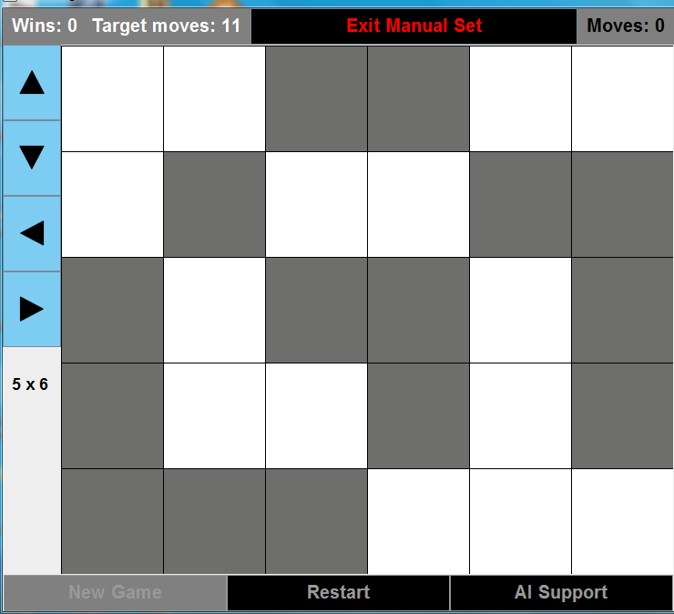
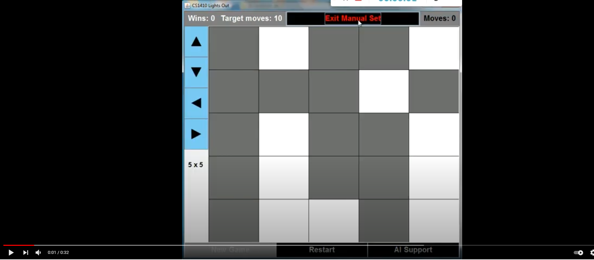

# Lights-Out-with-AI-solver  
Lights out game
## Tools
JFrame
## Features:
flexible table size, generating a new game, finding the best solution

## Video Link: Note the left and right buttons perform opposite in the app than what's in the video.

 
  <kbd>
    
  </kbd>

## Reference
https://www.jaapsch.net/puzzles/lomath.htm

